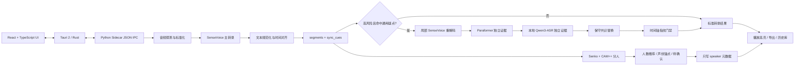

# LocalScribe 项目能力与面试说明

**版本**：1.0.3

**交付平台**：macOS Apple Silicon（M1/M2/M3/M4）
**项目定位**：面向会议、访谈、业务沟通等场景的本地优先录音转写与会议内容处理桌面应用。

---

## 1. 项目一句话介绍

我负责将本地语音识别、时间对齐、说话人分离、声纹校准和桌面端交付串成一个可用产品。它以 **SenseVoice 为中文转写主模型**，通过 **本地多模型疑点复核**、**冻结时间轴**、**CAM++ 声纹分离** 和 **Tauri 桌面端封装**，让用户可以在不上传原始录音的前提下完成转录、回听定位、分人、导出和文本处理。

核心原则是：**默认快速、保真、离线；只对高风险疑点做局部复核；任何附加能力都不能破坏已生成的文字和播放时间轴。**

---

## 2. 已交付能力

### 2.1 本地转文字

- 支持 MP3、M4A、WAV、MP4、MOV 等常见音视频文件。
- 默认使用 `SenseVoiceSmall` 做中文 ASR；Apple Silicon 上本地运行。
- 提供 MLX Whisper、faster-whisper/CT2、FunASR 等后端兜底与开发调试能力。
- 自动输出简体中文、标点、分段、段级时间戳和用于播放同步的 `sync_cues`。
- 支持热词输入、术语一致性检查、保守的文本规范化与 TXT/Markdown/SRT/JSON 导出。
- 历史转录、设置和导出记录存放于用户本机 `~/Library/Application Support/LocalScribe/`。

### 2.2 音频质量与稳健性处理

- 先通过 `ffprobe` 获取声道、采样率、时长等基础信息。
- 使用自适应预处理：统一到适合 ASR 的单声道、16 kHz PCM，并按质量门禁决定是否做保守响度处理。
- 检测低信噪比、噪声底、削波/爆音、声道问题等风险，并把结果写入质量报告。
- AI 降噪使用 DeepFilterNet 作为**可选能力**，不强制进入默认主链路，避免降噪损伤清晰录音的原始语义。

### 2.3 局部多模型复核，而不是全篇“AI 改写”

这是转写质量部分最重要的工程设计。

- **主模型拥有时间轴**：SenseVoice 的 `segments`、`start/end` 与 `sync_cues` 是正文和播放同步的唯一时间轴来源。
- **辅助模型只做证据，不替换整篇文本**：Paraformer 用于独立检测/对齐；本地 `Qwen3-ASR-1.7B-8bit` 用于高风险窗口的另一份独立识别证据。
- **标准模式优先速度**：绝大多数录音只走 SenseVoice 主链路。只有音质风险和通用文本结构异常共同满足时，才最多抽取少量短窗口进行复核。
- **强模式优先核验**：用户显式选择高质量模式后，才允许更完整的本地多模型审计，代价是处理时间增加。
- **共识替换极度保守**：只有模型在同一上下文中对短错词达成一致才改写，例如将“流写分离”修正为“读写分离”。标准模式只允许等长短替换，不自动插入或删除没有独立时间归属的字，避免把“这块”擅自改成“这块儿”。
- **禁止录音特判**：选择窗口和替换规则不读取录音名、人名、固定时间点或固定句子，避免针对某一份录音调参。
- **时间轴冻结门禁**：每次复核后都比对时间轴指纹；若段数、起止时间或 `sync_cues` 几何发生变化，自动拒绝复核结果，保留主转录。

### 2.4 回听时文字精准定位

- 音频播放进度会映射到当前 `sync_cues`，高亮当前语句并自动滚动定位。
- 光标/高亮基于音频真实播放时间，而非前端估算进度。
- 对长录音采用时间锚点和段级 cue；文本更新不会改写 cue 的开始与结束时间。
- 支持点击文字跳转播放，也支持从音频播放反向定位文字。

### 2.5 说话人分离与声纹校准

- 默认引擎为 **Senko + CAM++ 中文声纹模型**，CAM++ 输出 192 维声纹嵌入。
- 支持自动评估 2-8 人候选、推荐说话人数，也支持用户指定人数重新分离。
- 在 VAD 语音区间、声纹嵌入、聚类、时间连续性、短句继承、段内切换等层面做后处理。
- 对重叠语音、短插话、低置信标签不强行伪造身份，而是标为“待确认”。
- 支持声纹锚点：用户确认一段高质量单人语音后，可注册为真实姓名并回扫当前录音；注册前有质量预检，识别结果默认不自动反写污染声纹库。
- 分人链路只更新 `speaker` 等元数据，受“文本、段数、时间轴、sync cues 不变”门禁约束，不能破坏转写或播放功能。

### 2.6 内容处理

- 可选 LLM 校对、文章排版、翻译；用户显式配置 API 后才会调用外部模型。
- API Key 使用 macOS Keychain 保存；本地 ASR、分人、音频文件不需要上传。

### 2.7 桌面交付与运维

- 前端采用 React + TypeScript，桌面壳采用 Tauri 2 + Rust，模型服务采用 Python sidecar，通过 JSON IPC 通信。
- App 内置 Python 3.12、ffmpeg/ffprobe、SenseVoice、Paraformer、Qwen3-ASR、Senko/CAM++ 等运行资源，客户无需安装 Python 或下载模型。
- 构建阶段校验离线模型清单与 SHA-256，并在资源注入后重新签名 App。
- 当前交付包为约 4.5 GB 的 `tar.gz`，解压后得到约 6.5 GB 的本地离线 App。

---

## 3. 技术架构

### 分层职责

| 层 | 技术 | 主要职责 |
|---|---|---|
| UI | React、TypeScript | 拖拽上传、任务状态、转写展示、播放同步、分人确认、导出 |
| Desktop | Tauri 2、Rust | 原生窗口、文件/设置/钥匙串、Sidecar 生命周期、应用资源路径 |
| ASR Service | Python 3.12、JSON IPC | 音频处理、模型调用、质量报告、导出与业务编排 |
| 主转录 | SenseVoiceSmall | 默认中文转录与基础段落时间轴 |
| 复核 | Paraformer、Qwen3-ASR 1.7B | 只对高风险短窗提供独立证据 |
| 分人 | Senko、CAM++、VAD | 说话人切分、人数推荐、声纹匹配与待确认标记 |
| 内容生成 | OpenAI-compatible API、DeepSeek | 可选校对、文章排版、翻译 |
| 交付 | bundle staging、codesign、离线 manifest | 模型内置、哈希校验、可移植 App 打包 |

---

## 4. 核心工程难点与解决方法

### 难点一：准确率、速度和时间轴不能同时靠“重跑全篇”解决

**问题**：如果每份录音都用多个大模型全文重跑，速度会变慢，而且不同模型分段不同，文字和播放光标会错位。

**方案**：采用“主模型时间轴 + 局部独立复核 + 冻结门禁”。

1. SenseVoice 始终保留原始段落与时间边界。
2. 先用音频质量和文本结构规则定位少量疑点窗口。
3. Paraformer 和 Qwen 分别识别该窗口，只有上下文一致的短改动才能写回。
4. 写回后重新计算 timeline fingerprint；指纹变化即回滚。

**收益**：不牺牲正常录音的速度，也不会因为辅助模型重新分段而破坏播放同步。

### 难点二：不能针对“录音 3/录音 10”写死规则

**问题**：真实项目最容易陷入“用户指出一处错误，代码写一条替换规则”的局面。这样一份录音看似变好，换录音就退化。

**方案**：把每次反馈抽象为通用约束，而非固定文本：

- 用通用异常特征选疑点，如异常小写英文碎片、重复词、词法碎片。
- 用上下文一致性、独立模型一致性、候选长度和敏感词保护来决定是否替换。
- 人名、数字、称谓、语气词、可能同音词默认不自动猜测。
- 新策略必须同时经过旧录音冻结集、陌生录音抽样集和时间轴回归。

### 难点三：分人不能影响转写

**问题**：早期常见问题是分人后重分段，导致原本正确的文本段、光标和导出时间发生变化。

**方案**：将 ASR 与 diarization 解耦。

- ASR 先完成并冻结 `text/start/end/sync_cues`。
- 分人只生成或修正 `speaker` 元数据。
- 所有分人候选都走文本几何校验；若检测到分人处理改变了文本或时间轴，直接丢弃候选。

### 难点四：盲分离不能可靠地直接“认出张三”

**问题**：无声纹库时，系统只能做聚类，不应该把 `SPEAKER_A/B` 硬说成真实姓名。

**方案**：设计分层降级和人工校准。

1. 先做无身份的说话人聚类与人数推荐。
2. 重叠、短句、低置信结果显示待确认。
3. 用户选取高质量单人片段作为声纹锚点，注册真实姓名。
4. 仅由用户明确确认的锚点进入声纹库；自动匹配结果不自动回写，避免一次误判污染后续会议。

### 难点五：离线大模型交付不能只打一个“空壳 App”

**问题**：模型、Python 依赖、ffmpeg 与 Rust App 都要在客户电脑离线运行；资源注入后还会导致签名失效。

**方案**：构建分为 staging、资源注入、离线模型清单校验、重签名四步。

- 先准备可重定位 Python 与本地模型缓存。
- 注入到 `LocalScribe.app/Contents/Resources/`。
- 对 Qwen 权重及配置做 SHA-256 清单校验，并实际加载模型。
- 注入完成后执行 `codesign --verify --deep --strict`。

---

## 5. 数据与效果应如何准确表述

### 可以表述的内部验证结果

| 维度 | 内部验证结果 | 说明 |
|---|---:|---|
| 默认 ASR 抽样集 | 99.02% 字符准确率 | 50 段、约 8.3 分钟、2244 个参考字符；覆盖电话业务、节目、讲道/查经等真实中文录音 |
| 独立陌生短片集 | 99.35% 字符准确率 | 3 份未参与参数选择的录音，9 个绝对时间片段，308 个参考字符 |
| 完整 App 同批片段回放 | 96.10% 字符准确率 | 9 个片段、308 字；用于揭示长录音局部解码仍可能退化 |
| 连续分人真值 | DER 16.28%，JER 28.58%，人数误差 0 | 3 份录音、约 30 分钟；不同噪声和重叠场景差异较大 |
| App 交付校验 | 通过 | 前端生产构建、Python 回归、离线 Qwen 完整加载、CAM++ 推理、arm64 检查、严格签名 |

### 必须同时说明的边界

- 99% 是特定人工标注样本上的字符级结果，**不是所有录音、所有方言、所有噪声条件下的通用承诺**。
- 长录音、远场收音、多人抢话、方言、专业术语和数字串仍可能降低转写或分人质量。
- 分人属于盲聚类问题，重叠语音与相近声线需要人工确认或声纹锚点协助。
- 强复核模式会增加耗时，标准模式优先保证速度和稳定时间轴。
- 当前正式交付仅面向 Apple Silicon Mac，采用 ad-hoc 签名，首次启动可能需要用户在 macOS 中右键“打开”。

这类表述比“我们任何录音都能达到 99%”更专业，也更经得起客户和面试追问。

---

## 6. 面试时如何介绍

### 6.1 30 秒版本

我做过一个本地优先的语音转写桌面产品 LocalScribe。技术上是 React + Tauri + Rust + Python Sidecar，默认用 SenseVoice 做中文 ASR，并用 Paraformer 和本地 Qwen3-ASR 对高风险短片段做三模型保守复核。核心工程点是把文本时间轴冻结，任何纠错和分人都不能影响播放光标；分人使用 Senko + CAM++，并设计了声纹锚点和人工待确认机制。最终交付为内置模型和 Python 运行时的离线 macOS App。

### 6.2 2 分钟版本

这个项目的目标不是做一个单模型 Demo，而是做可交付的本地录音处理工具。用户拖入录音后，系统先分析音频质量并统一采样格式，然后用 SenseVoice 产生带时间戳的主转录。前端播放和文字高亮完全依赖这份时间轴，因此我没有让辅助模型全文覆盖主文本。

我设计了局部多模型复核机制：只有高风险且文本表现出通用异常的短窗口，才调用 Paraformer 和本地 Qwen3-ASR；只有三方在同一上下文中确认的短错词才能替换。所有替换之后都要通过段数、时间边界和 `sync_cues` 指纹校验，否则回退原文。这解决了“提高准确率却把光标搞乱”的工程矛盾。

分人部分我将它与 ASR 解耦，采用 Senko + CAM++ 做说话人嵌入和人数推荐，只更新 speaker 元数据，不改变文字和时间。针对无声纹库无法准确识别姓名的问题，我加入声纹锚点质量预检、双阈值匹配和人工确认回写，避免错误自动累积。最后我把 Python、模型、ffmpeg 打进 Tauri App，做离线模型哈希和签名验证，保证客户不需要安装开发环境。

### 6.3 适合写在简历上的项目描述

**LocalScribe - 本地优先的语音转写桌面应用**
`React` `TypeScript` `Tauri` `Rust` `Python` `SenseVoice` `FunASR` `Qwen3-ASR` `CAM++`

- 设计并实现离线语音处理流水线：音频质量门禁、16 kHz 标准化、中文 ASR、标点/简繁规范化、段级时间轴与播放器文字同步。
- 构建“主模型时间轴 + 多模型局部共识”纠错机制，使用 SenseVoice、Paraformer、Qwen3-ASR 对高风险短窗进行保守复核，并以时间轴指纹保证纠错不破坏播放定位。
- 实现 Senko + CAM++ 说话人分离、2-8 人数推荐、低置信待确认、声纹锚点重识别；通过数据结构与回归门禁确保分人不改写 ASR 文本和时间几何。
- 采用 Tauri/Rust + Python Sidecar 构建桌面端，完成离线模型资源注入、SHA-256 完整性校验、macOS arm64 签名及自包含交付。
- 在内部人工标注中文样本中，默认 ASR 抽样字符准确率达到 99.02%；同时建立陌生录音与完整 App 回归集，避免仅针对固定录音优化。

### 6.4 常见追问与回答要点

| 追问 | 回答要点 |
|---|---|
| 为什么不用大模型直接全文改写？ | 大模型容易幻觉且会破坏段落边界。产品需要可回听、可导出、可追责，因此主模型拥有时间轴，辅助模型只对短疑点提供证据。 |
| 怎么证明不是针对某一份录音优化？ | 不使用录音名、固定文本、固定时间点或固定人名作为规则；每次修改同时跑冻结集和未参与调参录音，并保留 CER/时间轴/分人指标。 |
| 为什么分人不直接显示真实姓名？ | 无声纹库只能做聚类，硬贴身份会制造错误。先用 SPEAKER 标签，用户确认高质量片段后再建立声纹锚点，自动匹配结果不自动污染库。 |
| 如何保证播放光标准确？ | 将 `sync_cues` 作为独立数据契约，所有 ASR 纠错和分人后处理必须通过时间几何指纹；不允许改 cue 的时间边界。 |
| 离线包为什么这么大？ | 包内包含 Python 运行时、多个本地 ASR/声纹模型、ffmpeg 和降噪资源，换取客户机器无需安装依赖和原始音频不上传。 |
| 你如何处理准确率宣传？ | 区分人工标注样本 CER、完整录音结果和不同噪声场景；不把局部 99% 样本夸大为全场景 99%。 |

---

## 7. 客户可读的能力说明

LocalScribe 是一套本地部署的录音转文字工具。日常转录和说话人分离在本机完成，原始音频不需要上传服务器。系统支持导入常见录音文件、自动生成带时间的逐字稿、回听同步高亮、说话人标签、TXT/Word/字幕等导出，也支持可选的校对、文章排版和翻译。

对于清晰中文录音，系统优先保证速度、文字保真和时间轴稳定。对于存在明显噪声和结构异常的少数片段，系统会在本地触发受限的多模型复核，只修正多模型一致确认的短错词，避免“为了润色而改变原话”。多人录音可以自动推荐人数并给出说话人标签；对于抢话、短句或声线接近的情况，会保留待确认入口，并支持通过少量已确认语音建立声纹锚点，提高后续识别的稳定性。

---

## 8. 当前交付与后续方向

### 当前交付

- 交付包：`LocalScribe_1.0.3_aarch64.tar.gz`
- 支持平台：Apple Silicon macOS
- 包含：离线 ASR、局部复核、分人/声纹、播放同步、导出、校对、文章排版和翻译。
- 验证：包体完整性、离线 Qwen 模型 SHA-256、CAM++ 模型加载、App 严格签名均已完成。

### 后续优化方向

1. 扩充更多未参与调参的连续人工真值，按场景持续评估 CER/DER/JER。
2. 提升远场、重叠语音和相近声线条件下的分人效果，评估更强的重叠语音检测与端到端 diarization 模型。
3. 将“待确认”做成更高效的批量人工校准流程，提升声纹锚点跨会议复用体验。
4. 增加 Intel Mac、Windows 和 Linux 的跨平台打包与性能优化。
5. 继续把高噪局部复核限定在高收益窗口，并基于人工真值监控误改率，而不是无限扩大自动改写范围。
